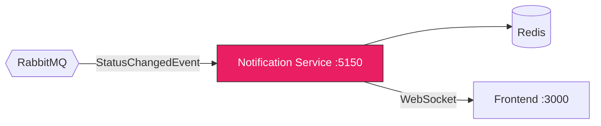

# :bell: ArchLens Notification Service

Real-time notification service using SignalR WebSockets with Redis backplane for horizontal scaling.

## Architecture Overview



## Tech Stack

| Technology | Purpose |
|---|---|
| .NET 9 | Runtime |
| SignalR | WebSocket hub |
| Redis | Backplane for scale-out |
| MassTransit | Event consumption |

## SignalR Hub

**Hub URL:** `/hubs/analysis`

| Method | Direction | Description |
|---|---|---|
| `JoinAnalysisGroup` | Client -> Server | Subscribe to a specific analysis updates |
| `LeaveAnalysisGroup` | Client -> Server | Unsubscribe from analysis updates |
| `JoinDashboard` | Client -> Server | Subscribe to global dashboard updates |

Status updates are pushed automatically to connected clients when `StatusChangedEvent` is consumed.

## Running

```bash
dotnet run --project src/ArchLens.Notification.Api
```

The service starts on **port 5150**.

## Environment Variables

| Variable | Description | Default |
|---|---|---|
| `Redis__ConnectionString` | Redis connection string | `localhost:6379` |
| `RabbitMq__Host` | RabbitMQ host | `localhost` |

## Events Consumed

- **StatusChangedEvent** — triggers real-time push to all subscribed WebSocket clients.
